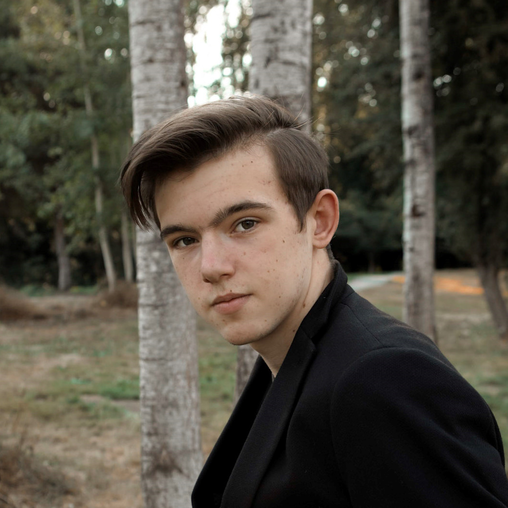

# Hello!
I'm **Cody Rupp**, a student studying Computer Science at _UC San Diego_.

Here is a picture of me: 

> Here is a quote

My favorite terminal command is: `cd .`

If you would like, feel free to connect with me on [my LinkedIn](https://www.linkedin.com/in/codyprupp/).

Outside of classes, I am actively involved in several projects, including [Triton Unmanned Aerial Systems](https://github.com/tritonuas#welcome-to-triton-uas). Here is a link to an image of one of the projects that I have worked on with TUAS, the _Antenna Tracker_: 